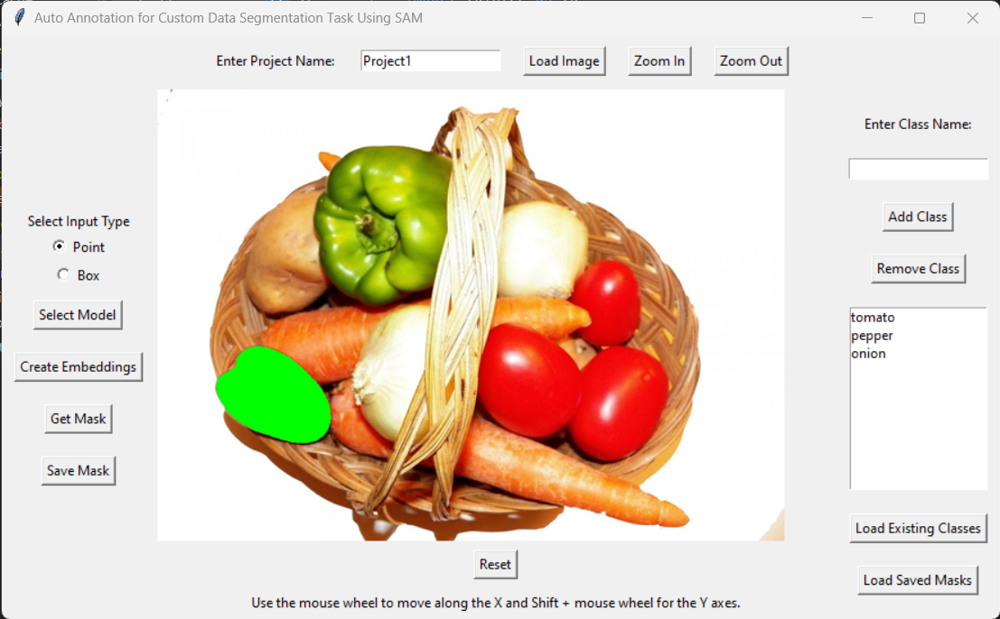
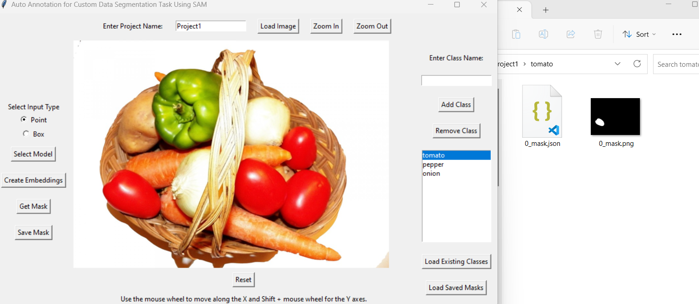

# SAM Model for Image Annotation

Annotating images for segmentation tasks can be a cumbersome process. This UI is created to simplify image annotation using Segment Anything Model (SAM). Easy annotate takes both point input and bounding box formats to create masks.

In this repository, I get the user input either in the form of input point or bounding boxes, create masks using SAM, and then save the resulting binary masks for selected objects. These binary masks can serve as a foundation for various custom segmentation tasks, and you can derive other formats from them as needed.

## Features

- Input support for both point input and bounding boxes.
- Efficient and accurate segmentation using SAM.
- Save binary masks for selected objects.
- A flexible baseline for custom segmentation tasks.

## Usage

To get started:

(install required libraries as in requirements.txt)

pip install opencv-python

(install torch - for my case this is the correct version)
pip3 install torch torchvision torchaudio --index-url https://download.pytorch.org/whl/cu117

pip install git+https://github.com/facebookresearch/segment-anything.git

download SAM model from this link to your local drive
https://github.com/facebookresearch/segment-anything#model-checkpoints

1. Create project and classs
2. Select model
3. Create embeddings - should be done for each image
4. Select input type
5. Get mask
6. Save mask
7. Check masks in the ./Projects/<your_project_name>

reload image if required

## Contributing

I welcome contributions from the community to enhance and improve this UI.

## License

This project is licensed under the [MIT License](/LICENSE), so feel free to use it in your projects or for any other purposes.

Happy annotating and segmenting of course!
